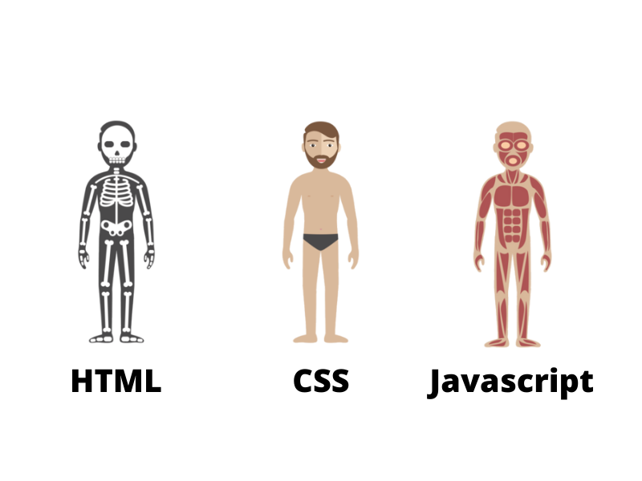

---

- [Descrição](#Descrição)
- [Projetos](#Projetos)
- [Autor](#Autor)

---

# Descrição

Esse é meu primeiro grande projeto onde, com a utilização das tecnologias: HTML (Responsável pela estruturação), CSS (Responsável pela estilização) e JavaScript (Responsável pela movimentação), desenvolverei 50 projetos web em 50 dias ou menos. O Objetivo é treinar os conhecimentos em web. Abaixo eu estou listando todos os projetos e suas páginas hospedadas dentro do Github Pages mesmo.

---

# Projetos

|  #  |  | |
| :-: | -------- | ------------- |
| 00  |  | |
| 01  |  | |

<!--
| 02  |  | |  O QUE ESTÁ EM MAIÚSCULO PODE SER TROCADO.
| 03  |  | |  O QUE ESTÁ EM MAIÚSCULO PODE SER TROCADO.
| 04  |  | |  O QUE ESTÁ EM MAIÚSCULO PODE SER TROCADO.
| 05  |  | |  O QUE ESTÁ EM MAIÚSCULO PODE SER TROCADO.
| 06  |  | |  O QUE ESTÁ EM MAIÚSCULO PODE SER TROCADO.
| 07  |  | |  O QUE ESTÁ EM MAIÚSCULO PODE SER TROCADO.
| 08  |  | |  O QUE ESTÁ EM MAIÚSCULO PODE SER TROCADO.
| 09  |  | |  O QUE ESTÁ EM MAIÚSCULO PODE SER TROCADO.
| 10  |  | |  O QUE ESTÁ EM MAIÚSCULO PODE SER TROCADO.
| 11  |  | |  O QUE ESTÁ EM MAIÚSCULO PODE SER TROCADO.
| 12  |  | |  O QUE ESTÁ EM MAIÚSCULO PODE SER TROCADO.
| 13  |  | |  O QUE ESTÁ EM MAIÚSCULO PODE SER TROCADO.
| 14  |  | |  O QUE ESTÁ EM MAIÚSCULO PODE SER TROCADO.
| 15  |  | |  O QUE ESTÁ EM MAIÚSCULO PODE SER TROCADO.
| 16  |  | |  O QUE ESTÁ EM MAIÚSCULO PODE SER TROCADO.
| 17  |  | |  O QUE ESTÁ EM MAIÚSCULO PODE SER TROCADO.
| 18  |  | |  O QUE ESTÁ EM MAIÚSCULO PODE SER TROCADO.
| 19  |  | |  O QUE ESTÁ EM MAIÚSCULO PODE SER TROCADO.
| 20  |  | |  O QUE ESTÁ EM MAIÚSCULO PODE SER TROCADO.
| 21  |  | |  O QUE ESTÁ EM MAIÚSCULO PODE SER TROCADO.
| 22  |  | |  O QUE ESTÁ EM MAIÚSCULO PODE SER TROCADO.
| 23  |  | |  O QUE ESTÁ EM MAIÚSCULO PODE SER TROCADO.
| 24  |  | |  O QUE ESTÁ EM MAIÚSCULO PODE SER TROCADO.
| 25  |  | |  O QUE ESTÁ EM MAIÚSCULO PODE SER TROCADO.
| 26  |  | |  O QUE ESTÁ EM MAIÚSCULO PODE SER TROCADO.
| 27  |  | |  O QUE ESTÁ EM MAIÚSCULO PODE SER TROCADO.
| 28  |  | |  O QUE ESTÁ EM MAIÚSCULO PODE SER TROCADO.
| 29  |  | |  O QUE ESTÁ EM MAIÚSCULO PODE SER TROCADO.
| 30  |  | |  O QUE ESTÁ EM MAIÚSCULO PODE SER TROCADO.
| 31  |  | |  O QUE ESTÁ EM MAIÚSCULO PODE SER TROCADO.
| 32  |  | |  O QUE ESTÁ EM MAIÚSCULO PODE SER TROCADO.
| 33  |  | |  O QUE ESTÁ EM MAIÚSCULO PODE SER TROCADO.
| 34  |  | |  O QUE ESTÁ EM MAIÚSCULO PODE SER TROCADO.
| 35  |  | |  O QUE ESTÁ EM MAIÚSCULO PODE SER TROCADO.
| 36  |  | |  O QUE ESTÁ EM MAIÚSCULO PODE SER TROCADO.
| 37  |  | |  O QUE ESTÁ EM MAIÚSCULO PODE SER TROCADO.
| 38  |  | |  O QUE ESTÁ EM MAIÚSCULO PODE SER TROCADO.
| 39  |  | |  O QUE ESTÁ EM MAIÚSCULO PODE SER TROCADO.
| 40  |  | |  O QUE ESTÁ EM MAIÚSCULO PODE SER TROCADO.
| 41  |  | |  O QUE ESTÁ EM MAIÚSCULO PODE SER TROCADO.
| 42  |  | |  O QUE ESTÁ EM MAIÚSCULO PODE SER TROCADO.
| 43  |  | |  O QUE ESTÁ EM MAIÚSCULO PODE SER TROCADO.
| 44  |  | |  O QUE ESTÁ EM MAIÚSCULO PODE SER TROCADO.
| 45  |  | |  O QUE ESTÁ EM MAIÚSCULO PODE SER TROCADO.
| 46  |  | |  O QUE ESTÁ EM MAIÚSCULO PODE SER TROCADO.
| 47  |  | |  O QUE ESTÁ EM MAIÚSCULO PODE SER TROCADO.
| 48  |  | |  O QUE ESTÁ EM MAIÚSCULO PODE SER TROCADO.
| 49  |  | |  O QUE ESTÁ EM MAIÚSCULO PODE SER TROCADO.
| 50  |  | | O QUE ESTÁ EM MAIÚSCULO PODE SER TROCADO.
-->

---

# Autor

Pessoa | Cargo | Social Link
:-----:|:-----:|:----------:
 |  | 
