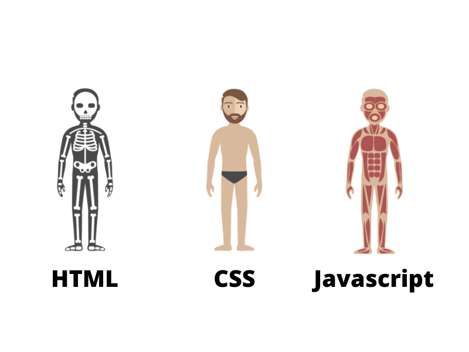

# English

---

- [About this](#About_this)
- [Projects](#Projects)
- [Authors](#Authors)

---

# About this

This is my first big project where, with the use of technologies: HTML (site structure), CSS (site glitter) and JavaScript (site dynamics), I will develop 50 web projects in 50 days or less. The objective is to train knowledge on the web. Below I'm listing all the projects and their pages hosted within Github Pages.

---

# Projects

|  #  |                                                                                                                                           |                                                                                                       |
| :-: | ---------------------------------------------------------------------------------------------------------------------------------------------------------------------------------------------------------------------------- | -------------------------------------------------------------------------------------------------------------------------------------------------------------------------------- |
| 00  |                                                      |      |
| 01  |                              |  |
| 02  |                                |  |
| 03  |  |  |
| 04  |                    |  |
| 05  |                                |  |
| 06  |                            |  |
| 07  |  | |
| 08  |  | |
| 09  |  | |
| 10  |  | |
<!--
| 11  |  | |
| 12  |  | |
| 13  |  | |
| 14  |  | |
| 15  |  | |
| 16  |  | |
| 17  |  | |
| 18  |  | |
| 19  |  | |
| 20  |  | |
| 21  |  | |
| 22  |  | |
| 23  |  | |
| 24  |  | |
| 25  |  | |
| 26  |  | |
| 27  |  | |
| 28  |  | |
| 29  |  | |
| 30  |  | |
| 31  |  | |
| 32  |  | |
| 33  |  | |
| 34  |  | |
| 35  |  | |
| 36  |  | |
| 37  |  | |
| 38  |  | |
| 39  |  | |
| 40  |  | |
| 41  |  | |
| 42  |  | |
| 43  |  | |
| 44  |  | |
| 45  |  | |
| 46  |  | |
| 47  |  | |
| 48  |  | |
| 49  |  | |
| 50  |  | |
-->

---

# Authors

|                                             Contributors                                             |                                        Responsibility                                         |                                                                          Social Link                                                                           |
| :--------------------------------------------------------------------------------------------------: | :-------------------------------------------------------------------------------------------: | :------------------------------------------------------------------------------------------------------------------------------------------------------------: |
|  |  |  |

# Português

---

- [Descrição](#Descrição)
- [Projetos](#Projetos)
- [Autores](#Autores)

---

# Descrição

Esse é meu primeiro grande projeto onde, com a utilização das tecnologias: HTML (estrutura do site), CSS (purpurina do site) e JavaScript (dinêmica do site), desenvolverei 50 projetos web em 50 dias ou menos. O Objetivo é treinar os conhecimentos em web. Abaixo eu estou listando todos os projetos e suas páginas hospedadas dentro do Github Pages mesmo.

---

# Projetos

|  #  |                                                                                                                                                 |                                                                                                 |
| :-: | ---------------------------------------------------------------------------------------------------------------------------------------------------------------------------------------------------------------------------------- | -------------------------------------------------------------------------------------------------------------------------------------------------------------------------------------------- |
| 00  |                                  |  |
| 01  |                                |      |
| 02  |                            |      |
| 03  |      |      |
| 04  |                            |      |
| 05  |  |      |
| 06  |                            |      |
| 07  |  | |
| 08  |  | |
| 09  |  | |
| 10  |  | |
<!--
| 11  |  | |
| 12  |  | |
| 13  |  | |
| 14  |  | |
| 15  |  | |
| 16  |  | |
| 17  |  | |
| 18  |  | |
| 19  |  | |
| 20  |  | |
| 21  |  | |
| 22  |  | |
| 23  |  | |
| 24  |  | |
| 25  |  | |
| 26  |  | |
| 27  |  | |
| 28  |  | |
| 29  |  | |
| 30  |  | |
| 31  |  | |
| 32  |  | |
| 33  |  | |
| 34  |  | |
| 35  |  | |
| 36  |  | |
| 37  |  | |
| 38  |  | |
| 39  |  | |
| 40  |  | |
| 41  |  | |
| 42  |  | |
| 43  |  | |
| 44  |  | |
| 45  |  | |
| 46  |  | |
| 47  |  | |
| 48  |  | |
| 49  |  | |
| 50  |  | |
-->

---

# Autores

|                                                Pessoa                                                |                                               Cargo                                               |                                                                          Social Link                                                                           |
| :--------------------------------------------------------------------------------------------------: | :-----------------------------------------------------------------------------------------------: | :------------------------------------------------------------------------------------------------------------------------------------------------------------: |
|  |  |  |
